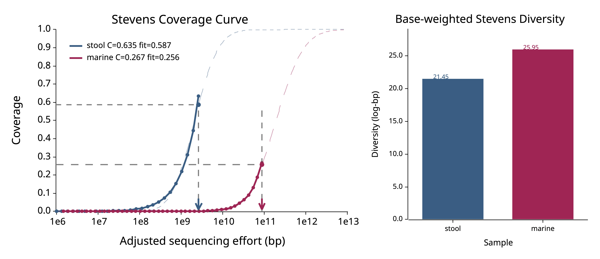

# FastCover

FastCover estimates long-read metagenomic coverage and diversity from read redundancy statistics. We name this diversity metric Stevens coverage and diversity (in memory of William Leslie Stevens).

The core component of FastCover is based on a minimizer Jaccard estimator implemented as a *seed-chain-quasi-alignment* framework, adapted here for metagenomic coverage and diversity estimation.

The core method uses SIMD canonical minimizer positions, deterministic twisted-tabulation rehashing, a shared-minimizer diagonal-band prefilter, de novo sliding offsets, and a bottom-k minimizer-window identity sketch. The winning sliding offset defines the semi-global overlap directly, then the default verifier runs rammap-core semi-global DP on the top alignment targets so final identity is base-level alignment identity rather than only a Jaccard estimate. A read contributes at most one non-self mate: FastCover selects the best verified alignment for each query, applies the identity and overlap filters to that single best hit, and randomly resolves exact ties using the run seed.

The minimizer window is derived by default from a TurboANI/MashMap-style p-value equation. For long-read overlap filtering the default calibration uses `k=16`, `--identity 95`, `--p-value 0.001`, an internal fragment length inferred from the sample mean read length, and `--reference-size 100000`. The fragment length controls minimizer sampling density; the 100 kb reference size controls the random-hit search space. The actual overlap length is not a global parameter: for each candidate pair, the winning sliding offset defines the aligned span. FastCover reports both a symmetric shorter-read overlap ratio, `alignment_ratio = overlap_len / min(query_len,target_len)`, and query-side coverage, `query_coverage = overlap_len / query_len`.

## Build
For CPU-optimized builds, follow the same target-CPU style used by TurboANI:

```bash
# Linux x86_64
RUSTFLAGS="-C target-cpu=x86-64-v3" cargo build --release

# macOS or local machine-specific build
RUSTFLAGS="-C target-cpu=native" cargo build --release
```

The lockfile pins `wide = 1.5.0`, matching the local TurboANI lockfile, because `simd-minimizers 3.0.0` plus `seq-hash 0.2.0` currently fails to compile with `wide 1.6.0` on this toolchain.

## Run

```bash
target/release/fastcover \
  --input reads.fastq.gz \
  --prefix out/fastcover \
  --kmer 16 \
  --identity 95 \
  --p-value 0.001 \
  --reference-size 100000 \
  --sketch-size 128 \
  --min-alignment-ratio 0.50 \
  --min-query-coverage 0.75 \
  --prefilter-targets 16 \
  --alignment-targets 3 \
  --max-hash-occ 128 \
  --diag-bin 1000 \
  --slide-radius 3000 \
  --slide-step 500 \
  --tab-hash-seed 42
```

By default, `fastcover` uses all logical CPU cores through Rayon. Use `--threads` only when you want to cap the worker count.

Coverage-curve effort is raw sampled bases by default. The production curve model is a two-component gamma mixture on `log1p(effort)`, which better matches long-tailed species/strain abundance structure than a single gamma curve. To reproduce the original Nonpareil-style log-effort adjustment, pass `--c-adjust` or `--c-adjust=0.27`; custom exponents must be strictly between `0` and `1`.

For multiple samples, use `--list` instead of `--input`. Each non-comment line is `path` followed by an optional sample label:

```text
sampleA.fastq.gz stool_A
sampleB.fastq.gz stool_B
```

List mode writes per-sample outputs as `PREFIX.<sample>.*` and a combined multi-sample plot as `PREFIX.svg` and `PREFIX.pdf`.

## Merge Plots From Independent Runs

For hundreds of samples, it is usually more efficient to run each sample independently on separate nodes and merge only the fitted model outputs afterward. The `fastcover-plot` binary reads per-sample `PREFIX.model.tsv` files and writes one combined SVG/PDF with the same two panels: Stevens coverage curves and Stevens diversity bars.

```bash
target/release/fastcover-plot \
  --model node1/stool_A.model.tsv \
  --model node2/marine_B.model.tsv \
  --label stool_A \
  --label marine_B \
  --prefix merged/cohort
```

For many samples, use a list file. Each non-comment line is `model_path` followed by an optional sample label:

```text
node1/stool_A.model.tsv stool_A
node2/marine_B.model.tsv marine_B
node3/soil_C.model.tsv soil_C
```

Then merge without rerunning minimizer search, chaining, alignment, or Monte Carlo resampling:

```bash
target/release/fastcover-plot \
  --list models.tsv \
  --prefix merged/cohort
```

## Thresholds

- `--identity` is used by the TurboANI-like sketch prefilter and, with the default final verifier enabled, by the rammap-core DP alignment identity filter. Set `--alignment-targets 0` for sketch-only behavior.
- `--identity` accepts either fractions (`0.995`) or percentages (`99.5`).
- `--sketch-size` controls the bottom-k minimizer hashes retained per overlap window.
- `--p-value`, the inferred filter fragment length, and `--reference-size` derive the minimizer window and first-pass shared-minimizer threshold when `--minimizer-window` and `--min-shared-minimizers` are not set.
- The inferred filter fragment length is the sample mean read length rounded to bases. It is only a p-value/sampling-density calibration, not a required overlap length.
- In `--list` mode, the inferred filter fragment length is computed independently for each sample. This keeps the prefilter sensitivity comparable across samples with different read-length distributions. The exact inferred length and resolved window are written to each `summary.tsv`.
- Larger `--reference-size` represents a larger random-hit search space, so it can require a larger sketch and therefore a smaller minimizer window for the same fragment length. It should not itself be used as the fragment length.
- For a strict computational benchmark where every sample must use exactly the same filter, set `--minimizer-window` and `--min-shared-minimizers` explicitly.
- `--min-shared-minimizers` is the first-pass prefilter override; reads below this shared-minimizer count in a diagonal band are never sliding-scored.
- `--prefilter-targets` is the number of seed-supported prefilter targets retained per query before final alignment. The default is `16`.
- `--alignment-targets` is the number of top sketch-passing targets searched with rammap-core semi-global DP per query. The default is `3`; values above `16` are rejected. Only the single best verified alignment is used for redundancy, so larger values increase search depth but cannot add multiple mates to one query.
- `--min-alignment-ratio` filters by the shorter-read overlap ratio, `overlap_len / min(query_len, target_len)`. This rejects tiny end overlaps and requires the shorter read to be meaningfully covered.
- `--min-query-coverage` filters by query-side coverage, `overlap_len / query_len`. This prevents a long query from being called redundant when only a small part of it overlaps a shorter target. The default is `0.75`; set it to `0` for shorter-read-only Nonpareil-like overlap behavior.
- `--c-adjust[=EXP]` enables optional Nonpareil-style adjusted effort, `E' = B * (E / B)^(C^EXP)`, where `B` is total sampled bases at full effort and `C` is the observed full-effort coverage. With no value, `EXP` is `0.27`; without the option, FastCover uses raw base effort, `E' = E`.

## Outputs

- `PREFIX.summary.tsv`: base-effort coverage-curve summary with mean, SD, and quartiles.
- `PREFIX.all.tsv`: all replicate values behind the curve.
- `PREFIX.model.tsv`: fitted mixture model diagnostics and curve points.
- `PREFIX.mates.tsv`: per-read selected non-self mate count and best verified neighbor. With the default final verifier, `mate_count` is binary: `1` when the best hit passes, otherwise `0`.
- `PREFIX.nonredundant.ids`: greedy representative read IDs.
- `PREFIX.svg`: vector coverage curve.
- `PREFIX.pdf`: vector coverage curve.

The plot is SVG and PDF only. The x-axis starts at `1e6` bp because smaller efforts are below the scale of most individual microbial genomes. The combined figure uses the left 60% for the Stevens coverage curve and the right 40% for a base-weighted Stevens diversity bar plot. Empirical lines/dots are emphasized, fitted model curves are thinner transparent dashed lines, grid lines are disabled, and multi-sample colors are generated with a golden-angle palette for many-sample overlays. The legend reports the observed current-effort coverage (`C`) and matched fitted coverage (`fit`); grey dashed guides mark current sequencing effort and the matched fitted coverage levels.

Here is an example:
<div align="center">
  
</div>


## Coverage Model

The coverage model treats observed redundancy as coverage for long reads, and `kappa` is the final redundant fraction. By default, effort is raw base effort, which is the most direct long-read interpretation. The optional `--c-adjust` switch applies the Nonpareil-style log-effort transform. FastCover's default long-read curve uses binary best-mate redundancy to generate its summary table rather than carrying all matching reads into the curve. The curve is base-weighted for long reads: resampling points are fractions of total bases, and each replicate reports redundant query bases divided by sampled query bases.

The default fitted curve is a two-component gamma mixture,

```text
C(E) = w * GammaCDF(log1p(E); shape1, rate1)
     + (1 - w) * GammaCDF(log1p(E); shape2, rate2)
```

This is useful in practice because microbial species and strain abundances are often close to log-normal or otherwise long-tailed. A mixture can place one component on abundant/core sequence space and another on rarer targets, while a single gamma distribution must smear both regimes into one shape. Stevens diversity is reported as the area under the fitted survival curve on the log-effort axis:

```text
D = integral_0^inf (1 - C(exp(x) - 1)) dx
```

`diversity_q99` reports the same area truncated at the fitted 99% quantile, and `remaining_diversity_at_observed_effort` reports the fitted survival area still beyond the observed sequencing effort. `LRstar` is the effort required to reach 95% modeled coverage. The original gamma-default implementation is saved on the `gamma-model` branch, and the generalized-gamma implementation is saved on the `generalized-gamma-model` branch.
